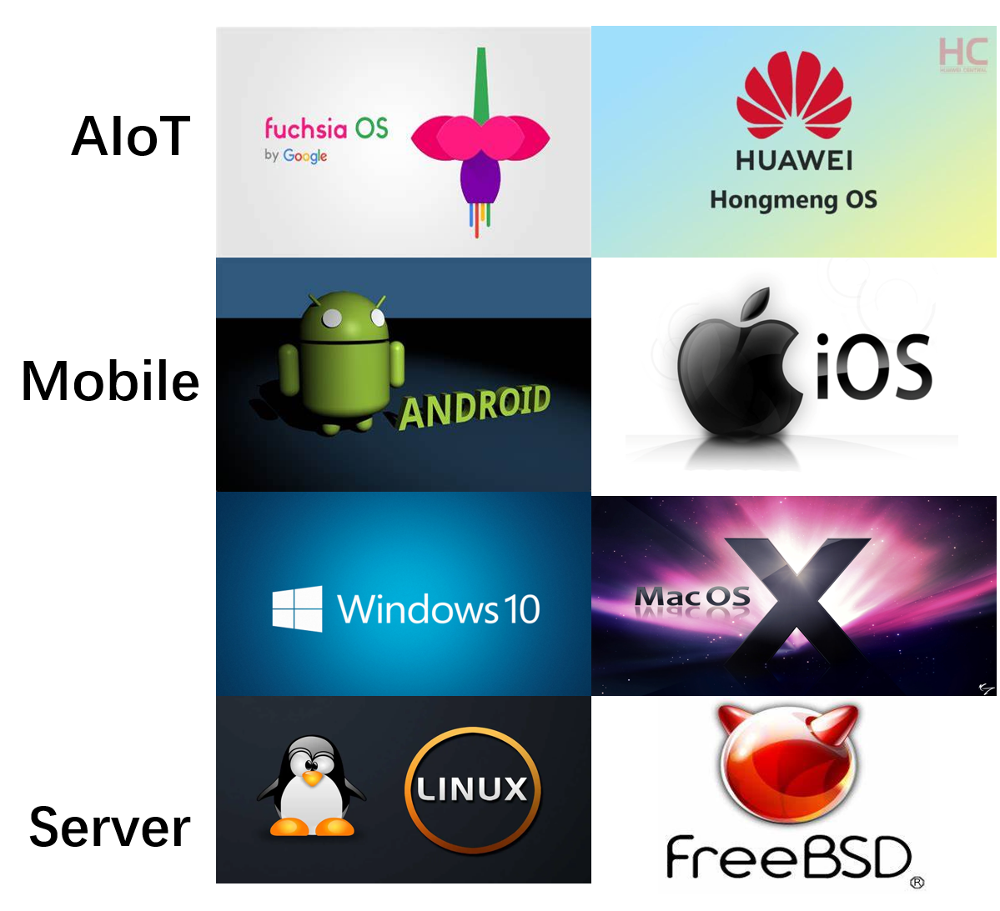
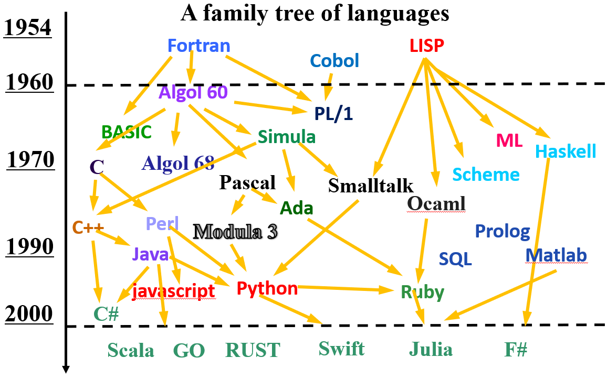

<!-- theme: gaia -->
<!-- _class: lead -->

 
 

# 开源教育的实践与思考
## 以操作系统为例

 
 

陈渝
国防科技大学 清华大学
 

2023年3月19日

---
# 个人情况
- 1989--2000 国防科技大学计算机学院
- 2000--2023 清华大学计算机系
- 2013--2013 MIT-EECS访问学者 

目前主要在清华大学做操作系统相关的教学与科研工作

---
# 学习情况
在国防科大计算机系本科阶段学习了操作系统相关的课程
- 操作系统课任课老师：刘春林 邹鹏
- 本科毕设指导老师：张晨曦
  - 知道了操作系统的基本概念和UNIX

在国防科大计算机系605教研室完成了研究生阶段的学习
- 研究生导师：陈福接 杨学军 及兰盛 
- 课题指导教师： 张为民和605教研室的各位老师 
  - 使用/阅读/修改/运行/调试Linux操作系统和各种应用

---
# 教学情况
在清华多个院系上操作系统相关的课程

---
# 教学情况

---
# 操作系统教学 --历史

---
# 操作系统教学 --历史
- 大约在1994年以前
  - 国内外教材相对较少
  - 操作系统教学以讲解原理为主
  - 结合部分模拟方式的编程实验
- 大约在1994年以后
  - 国内外教材逐渐多起来
  - 互联网逐渐广泛使用
  - Linux等开源软件在国内出现
  - 在国内逐渐开始重视实践教学

---
# 操作系统教学 --历史
**处理器的选择**

---
# 操作系统教学 --历史
**编程语言的选择**

---
# 操作系统教学 --历史
**编程语言的选择**

- 用C语言写OS 
  - MIT 6.828/6.S081
  - Harvard cs161
  - Stanford cs140/140e
  - Univ. of Wisc. CS-537 

---
# 操作系统教学 --历史
**编程语言的选择**

- 用GO写OS
  - [MIT: biscuit](https://github.com/mit-pdos/biscuit/)

- 用rust写OS
  - [Stanford: cs140e](https://web.stanford.edu/class/cs140e/)
  - [清华: rCore-Tutorial](https://github.com/rcore-os/rCore-Tutorial-v3)
- 用 C# 写OS
  - 微软: Singularity 

---
### 清华的操作系统课程
清华大学相关院系的操作系统课程

---
### 清华的操作系统课程
学生反馈
- 太难，量太大，不会编程
- 觉得时间投入太大
- 部分同学为了学分而学
- 趣味性不足，缺少及时反馈
- 碰到问题难以及时获得帮助
- 就业并不看好
 

---
### 清华的操作系统课程

特点：**基本抽象（骨）大致不变，内容与实验（肉）一直在变化**

**骨** -- 基本抽象：进程、地址空间、文件
**肉** -- 方法技术：调度、页表、文件系统、同步互斥、指令集、配套实验设计...

---
### 清华的操作系统课程
特点：**基本（骨）不变，内容（肉）在变化** -- 骨架子大，没太多肉
- 1995年前，缺少对实际操作系统的分析
   - 学生感觉像说教类课，把背诵记忆作为主要学习手段
   - 几乎没有实践：只能说

---
### 清华的操作系统课程
特点：**基本（骨）不变，内容（肉）在变化** -- 骨头撑不起肉
- 2000~2007年，增加了对实际操作系统（Windows、Linux、Solaris）的分析
  - 学生感觉是雾里看花，只可远观，不过细品
  - 远看很漂亮，近看太复杂

  

---
### 清华的操作系统课程  
特点：**基本（骨）不变，内容（肉）在变化** -- 肉太厚
- 2008年，MIT教授Frans Kaashoek来清华访问，并引入xv6 for x86教学操作系统；后简化实验，形成uCore教学操作系统。
- 2008~2015，弱化对实际操作系统的深入分析，增加了对教学操作系统的分析与实践
  

---
### 清华的操作系统课程  

特点：**基本（骨）不变，内容（肉）在变化** -- 合适的肌肉与脂肪
- 2015年，探索 MIPS、ARM、OR1200、RISC-V
- 2017年，选择RISC-V
- 2018年，增加Rust编程语言
- 2021年，十余个功能递增的小OS

---
### 清华的操作系统课程  
特点：**基本（骨）不变，内容（肉）在变化** -- 组合出不同OS kernel
-  2022年，探索设计实现不同类型的OS内核组件，通过不同的组合方式，形成不同类型和特征的OS kernel

---
### 清华的操作系统课程  
#### [OS课程2023春-slides](https://learningos.github.io/os-lectures/) , [OS课程2023春-总体介绍](https://learningos.github.io/os-lectures/course-intro.html)
#### 课程实践课本 -- rCore Tutorial Book v3
-  [课程实践参考书](https://learningos.github.io/rCore-Tutorial-Book-v3/)，[课程实践代码](https://github.com/rcore-os/rCore-Tutorial-v3)

#### 课程实验内容 -- rCore Tutorial Guide 2023 Spring
- [实验文档](https://github.com/LearningOS/rCore-Tutorial-Guide-2023S/)   , [实验代码](https://github.com/LearningOS/rCore-Tutorial-Code-2023S)，[测试用例](https://github.com/LearningOS/rCore-Tutorial-Test-2023S) 

#### 课程实验内容 -- uCore Tutorial Guide 2023 Spring
- [实验文档](https://github.com/LearningOS/uCore-Tutorial-Guide-2023S/)   , [实验代码](https://github.com/LearningOS/uCore-Tutorial-Code-2023S)，[测试用例](https://github.com/LearningOS/uCore-Tutorial-Test-2023S) 

---
### 清华的操作系统课程  
**在线学习模式**
- [开源操作系统训练营](https://github.com/LearningOS)
- [开源操作系统在线学习资源](https://github.com/LearningOS/rust-based-os-comp2022/blob/main/relatedinfo.md)
- [开源操作系统训练营排行榜](https://learningos.github.io/classroom-grading/)

---
### [全国大学生计算机系统能力比赛](https://os.educg.net/)

---
### [操作系统内核实现比赛](https://os.educg.net/#/index?name=2023%E5%85%A8%E5%9B%BD%E5%A4%A7%E5%AD%A6%E7%94%9F%E8%AE%A1%E7%AE%97%E6%9C%BA%E7%B3%BB%E7%BB%9F%E8%83%BD%E5%8A%9B%E5%A4%A7%E8%B5%9B%E6%93%8D%E4%BD%9C%E7%B3%BB%E7%BB%9F%E8%AE%BE%E8%AE%A1%E8%B5%9B-%E5%86%85%E6%A0%B8%E5%AE%9E%E7%8E%B0%E8%B5%9B&index=1&img=3) +   [操作系统功能挑战比赛](https://os.educg.net/#/index?name=2023%E5%85%A8%E5%9B%BD%E5%A4%A7%E5%AD%A6%E7%94%9F%E8%AE%A1%E7%AE%97%E6%9C%BA%E7%B3%BB%E7%BB%9F%E8%83%BD%E5%8A%9B%E5%A4%A7%E8%B5%9B%E6%93%8D%E4%BD%9C%E7%B3%BB%E7%BB%9F%E8%AE%BE%E8%AE%A1%E8%B5%9B-%E5%8A%9F%E8%83%BD%E6%8C%91%E6%88%98%E8%B5%9B&index=1&img=4) 
  

---
### [操作系统内核实现比赛](https://os.educg.net/#/index?name=2023%E5%85%A8%E5%9B%BD%E5%A4%A7%E5%AD%A6%E7%94%9F%E8%AE%A1%E7%AE%97%E6%9C%BA%E7%B3%BB%E7%BB%9F%E8%83%BD%E5%8A%9B%E5%A4%A7%E8%B5%9B%E6%93%8D%E4%BD%9C%E7%B3%BB%E7%BB%9F%E8%AE%BE%E8%AE%A1%E8%B5%9B-%E5%86%85%E6%A0%B8%E5%AE%9E%E7%8E%B0%E8%B5%9B&index=1&img=3) +   [操作系统功能挑战比赛](https://os.educg.net/#/index?name=2023%E5%85%A8%E5%9B%BD%E5%A4%A7%E5%AD%A6%E7%94%9F%E8%AE%A1%E7%AE%97%E6%9C%BA%E7%B3%BB%E7%BB%9F%E8%83%BD%E5%8A%9B%E5%A4%A7%E8%B5%9B%E6%93%8D%E4%BD%9C%E7%B3%BB%E7%BB%9F%E8%AE%BE%E8%AE%A1%E8%B5%9B-%E5%8A%9F%E8%83%BD%E6%8C%91%E6%88%98%E8%B5%9B&index=1&img=4) 
  

---
### [操作系统内核实现比赛](https://os.educg.net/#/index?name=2023%E5%85%A8%E5%9B%BD%E5%A4%A7%E5%AD%A6%E7%94%9F%E8%AE%A1%E7%AE%97%E6%9C%BA%E7%B3%BB%E7%BB%9F%E8%83%BD%E5%8A%9B%E5%A4%A7%E8%B5%9B%E6%93%8D%E4%BD%9C%E7%B3%BB%E7%BB%9F%E8%AE%BE%E8%AE%A1%E8%B5%9B-%E5%86%85%E6%A0%B8%E5%AE%9E%E7%8E%B0%E8%B5%9B&index=1&img=3) +   [操作系统功能挑战比赛](https://os.educg.net/#/index?name=2023%E5%85%A8%E5%9B%BD%E5%A4%A7%E5%AD%A6%E7%94%9F%E8%AE%A1%E7%AE%97%E6%9C%BA%E7%B3%BB%E7%BB%9F%E8%83%BD%E5%8A%9B%E5%A4%A7%E8%B5%9B%E6%93%8D%E4%BD%9C%E7%B3%BB%E7%BB%9F%E8%AE%BE%E8%AE%A1%E8%B5%9B-%E5%8A%9F%E8%83%BD%E6%8C%91%E6%88%98%E8%B5%9B&index=1&img=4) 
  

---
### [操作系统内核实现比赛](https://os.educg.net/#/index?name=2023%E5%85%A8%E5%9B%BD%E5%A4%A7%E5%AD%A6%E7%94%9F%E8%AE%A1%E7%AE%97%E6%9C%BA%E7%B3%BB%E7%BB%9F%E8%83%BD%E5%8A%9B%E5%A4%A7%E8%B5%9B%E6%93%8D%E4%BD%9C%E7%B3%BB%E7%BB%9F%E8%AE%BE%E8%AE%A1%E8%B5%9B-%E5%86%85%E6%A0%B8%E5%AE%9E%E7%8E%B0%E8%B5%9B&index=1&img=3) +   [操作系统功能挑战比赛](https://os.educg.net/#/index?name=2023%E5%85%A8%E5%9B%BD%E5%A4%A7%E5%AD%A6%E7%94%9F%E8%AE%A1%E7%AE%97%E6%9C%BA%E7%B3%BB%E7%BB%9F%E8%83%BD%E5%8A%9B%E5%A4%A7%E8%B5%9B%E6%93%8D%E4%BD%9C%E7%B3%BB%E7%BB%9F%E8%AE%BE%E8%AE%A1%E8%B5%9B-%E5%8A%9F%E8%83%BD%E6%8C%91%E6%88%98%E8%B5%9B&index=1&img=4) 
 

---
### [操作系统内核实现比赛](https://os.educg.net/#/index?name=2023%E5%85%A8%E5%9B%BD%E5%A4%A7%E5%AD%A6%E7%94%9F%E8%AE%A1%E7%AE%97%E6%9C%BA%E7%B3%BB%E7%BB%9F%E8%83%BD%E5%8A%9B%E5%A4%A7%E8%B5%9B%E6%93%8D%E4%BD%9C%E7%B3%BB%E7%BB%9F%E8%AE%BE%E8%AE%A1%E8%B5%9B-%E5%86%85%E6%A0%B8%E5%AE%9E%E7%8E%B0%E8%B5%9B&index=1&img=3) +   [操作系统功能挑战比赛](https://os.educg.net/#/index?name=2023%E5%85%A8%E5%9B%BD%E5%A4%A7%E5%AD%A6%E7%94%9F%E8%AE%A1%E7%AE%97%E6%9C%BA%E7%B3%BB%E7%BB%9F%E8%83%BD%E5%8A%9B%E5%A4%A7%E8%B5%9B%E6%93%8D%E4%BD%9C%E7%B3%BB%E7%BB%9F%E8%AE%BE%E8%AE%A1%E8%B5%9B-%E5%8A%9F%E8%83%BD%E6%8C%91%E6%88%98%E8%B5%9B&index=1&img=4) 
 

---
### [操作系统内核实现比赛](https://os.educg.net/#/index?name=2023%E5%85%A8%E5%9B%BD%E5%A4%A7%E5%AD%A6%E7%94%9F%E8%AE%A1%E7%AE%97%E6%9C%BA%E7%B3%BB%E7%BB%9F%E8%83%BD%E5%8A%9B%E5%A4%A7%E8%B5%9B%E6%93%8D%E4%BD%9C%E7%B3%BB%E7%BB%9F%E8%AE%BE%E8%AE%A1%E8%B5%9B-%E5%86%85%E6%A0%B8%E5%AE%9E%E7%8E%B0%E8%B5%9B&index=1&img=3) +   [操作系统功能挑战比赛](https://os.educg.net/#/index?name=2023%E5%85%A8%E5%9B%BD%E5%A4%A7%E5%AD%A6%E7%94%9F%E8%AE%A1%E7%AE%97%E6%9C%BA%E7%B3%BB%E7%BB%9F%E8%83%BD%E5%8A%9B%E5%A4%A7%E8%B5%9B%E6%93%8D%E4%BD%9C%E7%B3%BB%E7%BB%9F%E8%AE%BE%E8%AE%A1%E8%B5%9B-%E5%8A%9F%E8%83%BD%E6%8C%91%E6%88%98%E8%B5%9B&index=1&img=4) 
 

---
### [操作系统内核实现比赛](https://os.educg.net/#/index?name=2023%E5%85%A8%E5%9B%BD%E5%A4%A7%E5%AD%A6%E7%94%9F%E8%AE%A1%E7%AE%97%E6%9C%BA%E7%B3%BB%E7%BB%9F%E8%83%BD%E5%8A%9B%E5%A4%A7%E8%B5%9B%E6%93%8D%E4%BD%9C%E7%B3%BB%E7%BB%9F%E8%AE%BE%E8%AE%A1%E8%B5%9B-%E5%86%85%E6%A0%B8%E5%AE%9E%E7%8E%B0%E8%B5%9B&index=1&img=3) +   [操作系统功能挑战比赛](https://os.educg.net/#/index?name=2023%E5%85%A8%E5%9B%BD%E5%A4%A7%E5%AD%A6%E7%94%9F%E8%AE%A1%E7%AE%97%E6%9C%BA%E7%B3%BB%E7%BB%9F%E8%83%BD%E5%8A%9B%E5%A4%A7%E8%B5%9B%E6%93%8D%E4%BD%9C%E7%B3%BB%E7%BB%9F%E8%AE%BE%E8%AE%A1%E8%B5%9B-%E5%8A%9F%E8%83%BD%E6%8C%91%E6%88%98%E8%B5%9B&index=1&img=4) 
 

---
### [操作系统内核实现比赛](https://os.educg.net/#/index?name=2023%E5%85%A8%E5%9B%BD%E5%A4%A7%E5%AD%A6%E7%94%9F%E8%AE%A1%E7%AE%97%E6%9C%BA%E7%B3%BB%E7%BB%9F%E8%83%BD%E5%8A%9B%E5%A4%A7%E8%B5%9B%E6%93%8D%E4%BD%9C%E7%B3%BB%E7%BB%9F%E8%AE%BE%E8%AE%A1%E8%B5%9B-%E5%86%85%E6%A0%B8%E5%AE%9E%E7%8E%B0%E8%B5%9B&index=1&img=3) +   [操作系统功能挑战比赛](https://os.educg.net/#/index?name=2023%E5%85%A8%E5%9B%BD%E5%A4%A7%E5%AD%A6%E7%94%9F%E8%AE%A1%E7%AE%97%E6%9C%BA%E7%B3%BB%E7%BB%9F%E8%83%BD%E5%8A%9B%E5%A4%A7%E8%B5%9B%E6%93%8D%E4%BD%9C%E7%B3%BB%E7%BB%9F%E8%AE%BE%E8%AE%A1%E8%B5%9B-%E5%8A%9F%E8%83%BD%E6%8C%91%E6%88%98%E8%B5%9B&index=1&img=4) 
 

---
### [操作系统内核实现比赛](https://os.educg.net/#/index?name=2023%E5%85%A8%E5%9B%BD%E5%A4%A7%E5%AD%A6%E7%94%9F%E8%AE%A1%E7%AE%97%E6%9C%BA%E7%B3%BB%E7%BB%9F%E8%83%BD%E5%8A%9B%E5%A4%A7%E8%B5%9B%E6%93%8D%E4%BD%9C%E7%B3%BB%E7%BB%9F%E8%AE%BE%E8%AE%A1%E8%B5%9B-%E5%86%85%E6%A0%B8%E5%AE%9E%E7%8E%B0%E8%B5%9B&index=1&img=3) +   [操作系统功能挑战比赛](https://os.educg.net/#/index?name=2023%E5%85%A8%E5%9B%BD%E5%A4%A7%E5%AD%A6%E7%94%9F%E8%AE%A1%E7%AE%97%E6%9C%BA%E7%B3%BB%E7%BB%9F%E8%83%BD%E5%8A%9B%E5%A4%A7%E8%B5%9B%E6%93%8D%E4%BD%9C%E7%B3%BB%E7%BB%9F%E8%AE%BE%E8%AE%A1%E8%B5%9B-%E5%8A%9F%E8%83%BD%E6%8C%91%E6%88%98%E8%B5%9B&index=1&img=4) 
 

---
### [操作系统内核实现比赛](https://os.educg.net/#/index?name=2023%E5%85%A8%E5%9B%BD%E5%A4%A7%E5%AD%A6%E7%94%9F%E8%AE%A1%E7%AE%97%E6%9C%BA%E7%B3%BB%E7%BB%9F%E8%83%BD%E5%8A%9B%E5%A4%A7%E8%B5%9B%E6%93%8D%E4%BD%9C%E7%B3%BB%E7%BB%9F%E8%AE%BE%E8%AE%A1%E8%B5%9B-%E5%86%85%E6%A0%B8%E5%AE%9E%E7%8E%B0%E8%B5%9B&index=1&img=3) +   [操作系统功能挑战比赛](https://os.educg.net/#/index?name=2023%E5%85%A8%E5%9B%BD%E5%A4%A7%E5%AD%A6%E7%94%9F%E8%AE%A1%E7%AE%97%E6%9C%BA%E7%B3%BB%E7%BB%9F%E8%83%BD%E5%8A%9B%E5%A4%A7%E8%B5%9B%E6%93%8D%E4%BD%9C%E7%B3%BB%E7%BB%9F%E8%AE%BE%E8%AE%A1%E8%B5%9B-%E5%8A%9F%E8%83%BD%E6%8C%91%E6%88%98%E8%B5%9B&index=1&img=4) 
 

---

<!-- theme: gaia -->
<!-- _class: lead -->

 

# 谢谢！

 

## 行胜于言 拥抱开源 
- https://github.com/learningOS/
- https://github.com/rcore-os/
