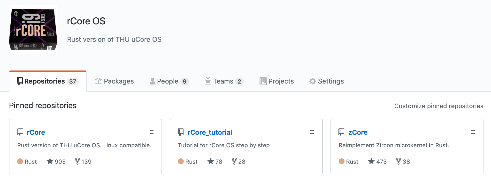
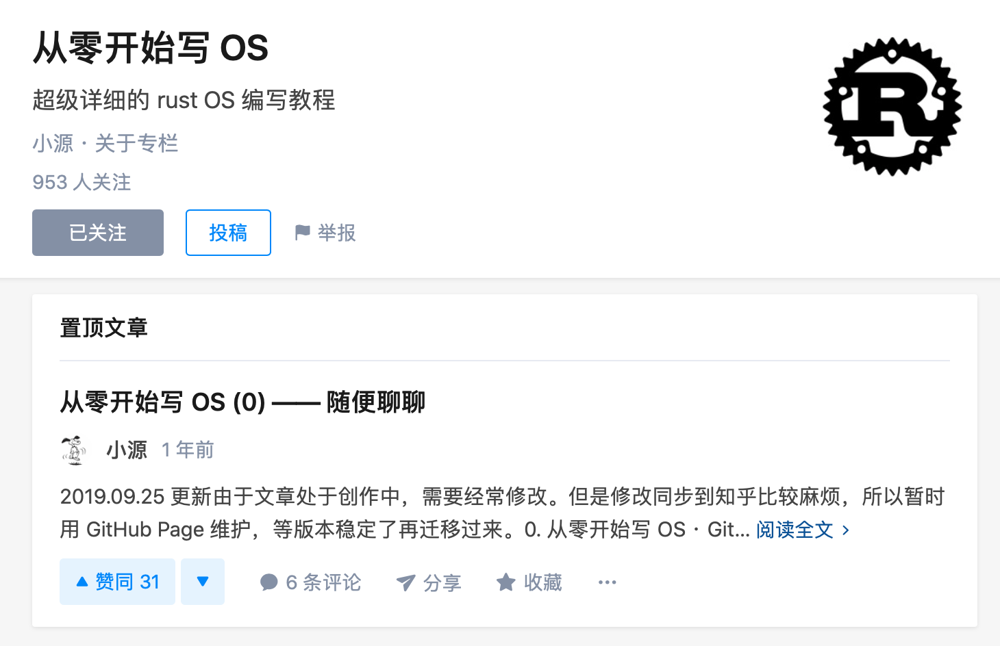

<!-- paginate: true -->

# Rust OS 开发历程与心得体会

王润基

2020.05.25 @ AOS 2020

---

# 自我介绍

* 本科清华计算机系五字班

* 目前在计算机系高性能所读硕士

  喜欢写代码，不喜欢科研

* 从大三下 OS 课开始，在陈渝老师指导下

  探索用 Rust 语言写 OS

---

# rCore

用 Rust 语言实现的小型操作系统。

兼容 Alpine Linux (musl libc)：Busybox, GCC, Nginx...
  
支持四种指令集：x86_64, ARM64, RISC-V, MIPS32

---

# rCore 社区

---

# Rust OS 在清华的发展现状

* 近两年 OS 课程设计的主旋律

* 2020 年 OS 课：可选 rCore 实验代替 uCore 实验（25%）

应该是：

* 国内最早用 Rust 写 OS 的尝试

* 国内最早用 Rust 语言开展教学的高校

---

# Rust OS 开发历史

* 2018.04：RustOS 在 OS2018 大实验立项

* 2018.07：移植到 RISC-V 并在板子上运行
* 2018.09：成为 OSTrain2018 的主题，移植到 ARM
* 2019.01：定名 rCore
* 2019.03：支持 Linux 系统调用，能够运行 shell, Nginx
* 2019.11：rCore Tutorial
* 2020.04：zCore 初步完成

---

## OS 课程设计

* 2018 操作系统课：1人
* 2018 计算机系统综合实验（造机小学期）：1人
* 2018 操作系统专题训练课：9人

* 2019 操作系统课：12人
* 2019 操作系统专题训练课：8人

* 2020 操作系统课：12人

---

## 【起】OS 2018

---

# uCore

C 语言实现的小型教学操作系统。

参考：xv6, OS161, Linux

* uCore Lab：OS 课程实验
* uCore Plus：OS 课程设计

---

### RustOS 立项动机

# C 语言太垃圾了！

- 内存不安全：SegmentFault！

- 缺少现代语言特性和好用的工具链

---

### RustOS 立项动机

# Rust 看上去不错！

- 内存+线程安全

- 高层语言特性
- 友好的工具链
- 蓬勃发展的社区生态

---

---

---

## OS 2018 + 小学期

* 基于 BlogOS，重新实现了一遍 uCore Lab

  能够二进制兼容运行 uCore 程序

* 从 x86_64 移植到了 RISC-V

  能够在 FPGA CPU 上运行

基本验证了 Rust 语言写 OS 的**可行性**。

---

## 感受

* 第一个月：暗无天日，没有走出 Lab 1

* 投入了整个学期一半的时间，收获巨大
* 发现自己之前对 OS 的好多理解都是错的
* Rust 大法好！

---

### 暗无天日的 Debug 生活

---

### 给自己挖的坑

---

## 【承】OSTrain 2018

---

## OSTrain 2018

* 从个人项目变为合作项目
* 进一步完善功能，达到和 uCore Lab 相同水平

* 移植到 ARM64 和 RISC-V64
* 开始进行教学实验的准备

---

---

## 感受

* 从独裁者到领导者的角色转变

* 维护一个合作项目不容易

* 认识了诸多大佬，日后都成为了好朋友

---

## 2019年：RustOS 被正式收购成为
# <!-- fit --> rCore

---

## 【转】OS 2019

---

### 新的目标已经出现！

---

### Biscuit

* Go 语言实现的 OS

* 内置 GC，基于 Goroutine
* 兼容 POSIX，支持运行 Nginx、Redis
* 性能相比 Linux 只差 5%-10%

那么，**Rust 能不能做得更好呢？**

---

### rCore 对标计划

* 扩充系统调用

  支持 Biscuit 的 libc？直接兼容 Linux？

* 实现网络功能

  补充网卡驱动、网络协议栈、Socket Syscall

* 进行性能测试

  需要在真机上运行

---

### 天降大任于——杰哥！

https://www.bilibili.com/video/av47855780

---

---

### vs Biscuit ... 终于还是凉了

* 同步互斥实现得比较糟糕：经常丢唤醒，死锁

* 真机调试十分麻烦

* 实现简陋，各种地方都可能是性能瓶颈

* 杰哥的兴趣转移到了路由器上0.0

---

## OS 2019

rCore：

* 支持 Linux 系统调用
  能够运行 Busybox、Nginx、Redis、GCC、Rustc

* 移植到 MIPS（为了龙芯杯）
* rCore step by step 
* 完善树莓派外设支持……

我：

* 作为助教，认识了更多对OS感兴趣的、很厉害的学弟~~学妹~~

* 作为学生，完成了毕业设计

---

## rCore Step by Step

---

## 感受

rCore：
* “支持 Linux 系统调用”是非常正确的决定

* 项目文档和教程非常重要，宣传也很重要
* 规模剧增，如何平衡快速开发与代码维护？

我：
* 深入理解了 Linux 系统调用的设计与实现

* 小朋友们太强了！

---

## 【合】OSTrain 2019 + OS 2020

---

## 反思 rCore 

#### Rust 应该怎么写？

设计风格仍有 C 语言痕迹，存在大量 unsafe 代码

#### 代码应该如何组织划分？

内核代码增长到 2 万行，模块化不够彻底

#### Linux 是不是最佳的设计？

宏内核，不区分线程与进程，存在 fork、signal 等历史糟粕

=> **需要一次彻底的重构**

---

# Fuchsia & Zircon

Google 秘密研发中的**开源**微内核系统
##
##
##
##
##
##
##
##
##

---

---

---

### 定期举行学术交流活动

---

### 偶尔蹦出的灵感

---

### 逐渐勾勒出最终的蓝图

---

### 疫情期间圈在家里写代码

---

# zCore: A Next Gen "Rust" OS!

* 可以完全在用户态开发、测试、运行

* 由若干 crates 组装而成，符合 Rust 社区标准

* First-class async！内核线程 => Future

* 里面包含一个新的 "rCore"

---

---

## 感受

Zircon：
* 作为微内核，功能划分清晰合理

* 微内核复杂的 IPC 为调试带来很大困难

zCore：

* 开发过程惊险刺激

* 两个人合作开发，沟通交流很愉快

---

## 终极目标？

# 证明 Rust 适合编写操作系统内核，
# 并且比 C/C++ 更能胜任这一任务。

---

# 总结：山寨操作系统的乐趣

* 2018：uCore

* 2019：Linux
* 2020：Zircon

---

## 山寨操作系统的收获

* 知识上：深入理解各种系统的接口设计和内部实现

* 技能上：熟练掌握各类开发工具和调试技巧
* 心态上：从此无惧任何系统设计与 Bug 挑战

---

## 山寨操作系统的经验

* 最有效的调试方法依然是 print，因此平时要打 log 

* 遵守行业标准，利用现有生态

* 掌控开发周期：快速迭代，定期汇报，反复重构

* 软件工程真的很重要：代码文档、自动测试

---

## 山寨操作系统的乐趣

坑大大小小，无穷尽也：
* 一个 syscall 实现了，下一个 syscall 蹦出来

* 一个 Bug 修掉了，两三个新 Bug 冒出来

充满了未知与挑战：
* 进入用户态，两眼一抹黑

* 必须留心蛛丝马迹，才能找出罪魁祸首

---

## 山寨操作系统的乐趣

但是：

* 你写下的每一行代码，最终都不可或缺

* 你偷懒埋下的每一个雷，迟早都会爆炸
* 你就是上帝，这个世界尽在你的掌控中

---

### 再来一回合！

---

# rCore Tutorial 2020

新鲜出炉的 Rust OS 教学实验（第三版）by 七字班同学

欢迎感兴趣的同学体验！
https://os20-rcore-tutorial.github.io/rCore-Tutorial-deploy/

---

# 谢谢大家
